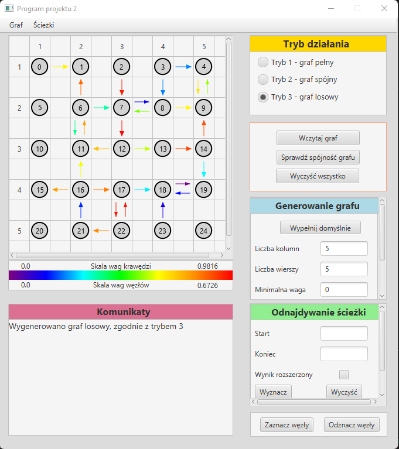
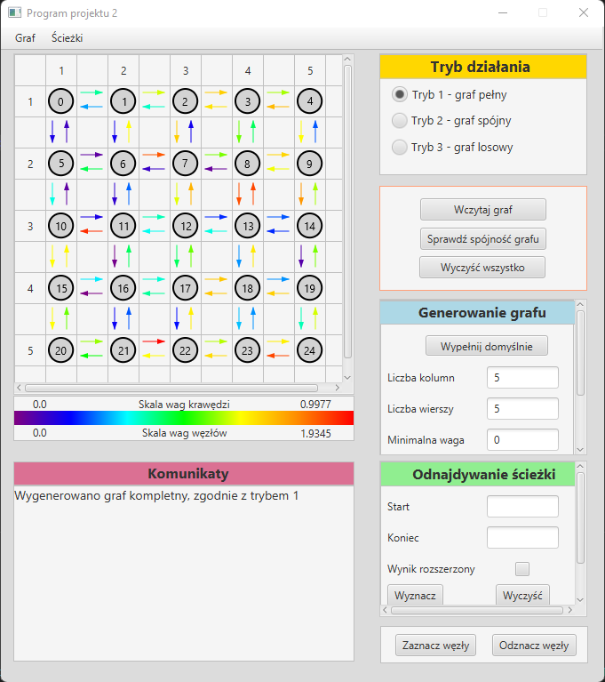
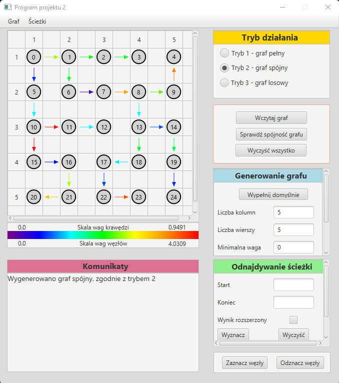
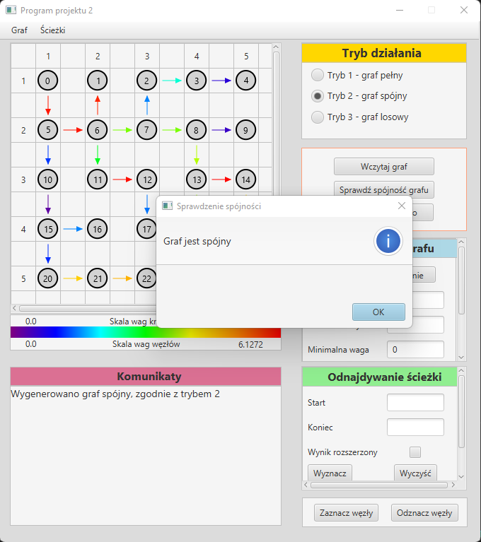
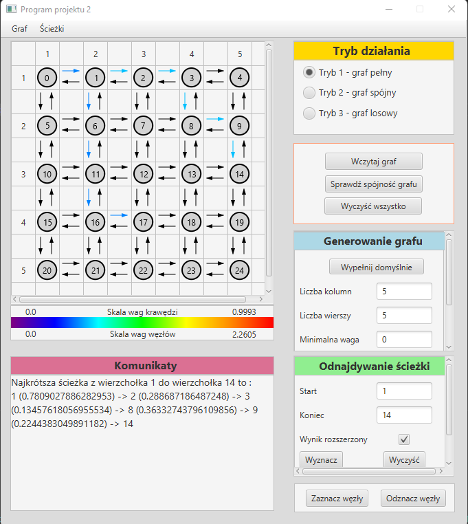
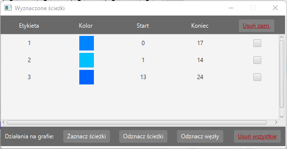
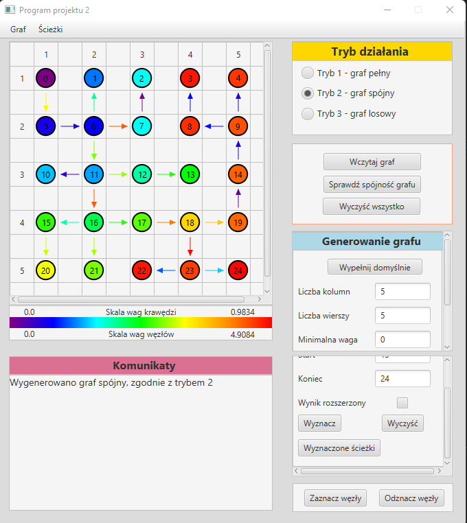

# Graph-generation-and-analysis-GUI
A program with a graphical interface enabling the generation of different types of graphs, their visualization, connectivity checking and finding shortest paths.

## Table of Contents
* [Background](#background)
* [General Info](#general-information)
* [Technologies Used](#technologies-used)
* [Features](#features)
* [Screenshots](#screenshots)

## Background
This project was created as a part of a course at the Warsaw University of Technology by Sebastian Pietrykowski and Paweł Borkowski.

## General Information
The project provides a user-friendly application for generating, visualizing, and analyzing graphs. It supports the generation of complete, connected, and random graphs with customizable weight ranges. The graphs are displayed on the screen with numbered vertices and colored edges. Users can find the shortest path between vertices, visualize paths and verify graph connectivity. File operations for loading and saving graphs are also available. The project aims to facilitate graph exploration and analysis in a user-friendly manner. User interface is only available in Polish.

## Technologies Used
- Java - version 1.8
- JUnit - version 4
- JavaFX - version 18
- Maven - version 4.0.0

## Features
The program provides the following functionalities:
- Graph Generation:
    - dimensions of the graph specified by providing number of rows and columns,
    - customizable range of weights,
    - generates a complete graph,
    - generates a connected graph,
    - generates a random graph.
- Graph Visualization:
    - displays the generated graph on a screen,
    - vertices are numbered,
    - edges are colored by its weight based on a gradient scale,
    - separate window to manage determined paths,
    - displays paths by its colors,
    - displays particular path by coloring its edges by weights and coloring vertices by shortest distances to them from source vertex.
- Graph Analysis:
    - finds the shortest possible path between any two vertices of the graph,
    - displays the determined paths on the graph visualization,
    - verifies the connectivity of the graph.
- File Operations:
    - loading graph from a file,
    - saving graph to a file.

## Screenshots

